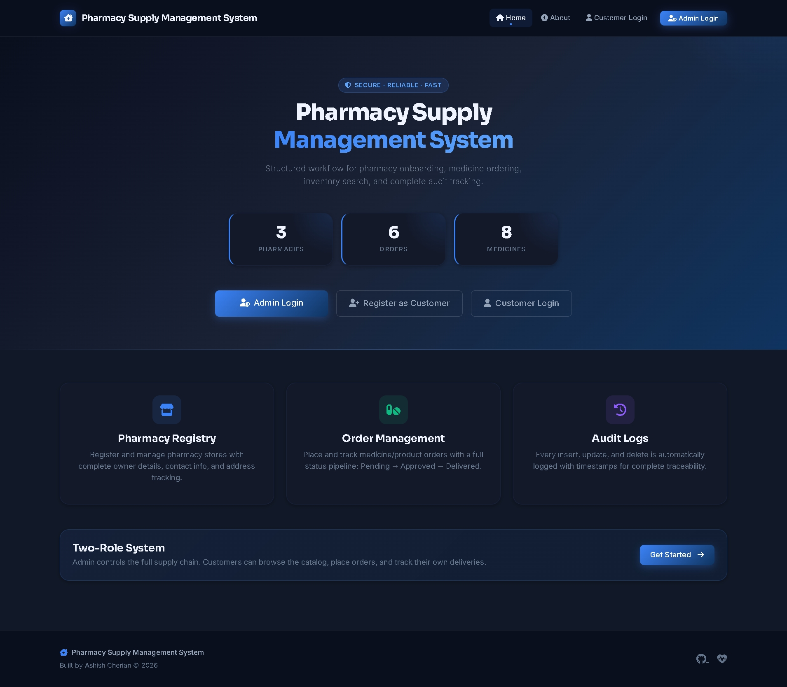

<div align="center">


<p>
  
  
  
  
  
</p>

<p>
  
  
  
  
  
</p>

[Live Demo](https://pharmacy-supply-management-system.vercel.app) · [Local Setup](#local-setup) · [Feature Showcase](#feature-showcase) · [Deployment](#deployment)

</div>

---

## Demo Credentials

Use these credentials for quick testing locally and on deployed app:

| Role | Login Route | Username or Email | Password |
|---|---|---|---|
| Admin | /login | owner | ChangeMe@123 |
| Customer | /customer/login | customer@example.com | Customer@123 |

---

## Overview

Pharmacy Supply Management System is a full-stack Flask web app designed to manage daily pharmacy supply operations with role-based access.

The project started as a DBMS mini-project and has been upgraded into a deployment-ready product with:

- Production database on Neon PostgreSQL
- Serverless deployment on Vercel
- Admin and Customer portals
- Chart-driven analytics and reporting
- CSV export, print-friendly order report, and audit logs

---

## Feature Showcase

This section is inspired by professional pharmacy-system showcases, but all capabilities below are mapped to your current Flask stack.

### Admin Workspace

| Module | What it does | Route |
|---|---|---|
| Dashboard | KPI cards + status and monthly charts | /dashboard |
| Pharmacy Registry | Add/edit/delete pharmacy stores | /insert, /edit/{id} |
| Order Management | Create orders, filter, status updates, delete | /medicines, /orders |
| Inventory Catalog | Manage medicines and products | /items, /items2 |
| Search | Fast search across catalog and records | /search |
| Reports | Revenue and operational insights | /reports |
| Logs | Auditable action history with export | /logs |

### Customer Workspace

| Module | What it does | Route |
|---|---|---|
| Registration/Login | Customer self-onboarding and access | /customer/register, /customer/login |
| Catalog | Browse medicines/products with autocomplete support | /customer/catalog |
| My Orders | Track status and cancel pending orders | /customer/orders |
| CSV Export | Export customer order history | /customer/orders/export/csv |

### Security and Data Integrity

- Password hashing via werkzeug.security
- CSRF protection on POST forms
- Role guards for admin/customer routes
- Session timeout for inactive users
- SQLAlchemy ORM usage (no raw SQL)

---

## Screenshots

### Admin Dashboard



### Recommended Showcase Captures

To match a high-quality README showcase style, add screenshots for these pages:

1. Admin Login
2. Dashboard Analytics
3. Add Pharmacy Form
4. Place Order Form
5. Orders Table with Status Controls
6. Customer Catalog
7. Customer My Orders
8. Reports and Charts

After adding screenshots under static/img, update this README with image markdown rows similar to the dashboard example.

---

## Tech Stack

| Layer | Technology |
|---|---|
| Backend | Python 3.13, Flask 3.1 |
| Data Layer | Flask-SQLAlchemy, SQLAlchemy 2.0 |
| Production DB | Neon PostgreSQL |
| Local DB fallback | SQLite |
| Frontend | Jinja2 templates, Bootstrap 5.3, Font Awesome |
| Visualization | Chart.js |
| Deployment | Vercel (serverless) |
| Config | python-dotenv |

---

## Architecture and Modules

```
Pharmacy-Supply-Management-System/
├── api/
│   └── index.py
├── app/
│   ├── __init__.py
│   ├── models.py
│   ├── utils.py
│   ├── main_routes.py
│   ├── auth/routes.py
│   ├── pharmacy/routes.py
│   ├── orders/routes.py
│   ├── inventory/routes.py
│   ├── customer/routes.py
│   └── reports/routes.py
├── templates/
├── static/
├── run.py
├── vercel.json
├── requirements.txt
└── .env.example
```

---

## Local Setup

### 1. Clone

```bash
git clone https://github.com/AshishCherian15/Pharmacy-Supply-Management-System.git
cd Pharmacy-Supply-Management-System
```

### 2. Create environment

```bash
# Windows
python -m venv venv
venv\Scripts\activate

# macOS/Linux
python3 -m venv venv
source venv/bin/activate
```

### 3. Install dependencies

```bash
pip install -r requirements.txt
```

### 4. Configure .env

```env
SECRET_KEY=your-random-secret-key
ADMIN_USERNAME=owner
ADMIN_PASSWORD=ChangeMe@123
SEED_DATA=true
# Keep DATABASE_URL blank to use local SQLite
```

### 5. Run

```bash
python run.py
```

Open http://localhost:5000

---

## Deployment

### Vercel + Neon

1. Create Neon DB and copy connection string.
2. Import repository in Vercel.
3. Add environment variables:

| Key | Value |
|---|---|
| SECRET_KEY | strong-random-secret |
| ADMIN_USERNAME | owner |
| ADMIN_PASSWORD | your-secure-admin-password |
| DATABASE_URL | Neon postgres URL |
| SEED_DATA | true |

4. Deploy and verify /api/health.

---

## Similar Enterprise Features: Current vs Next

To keep this project aligned with larger pharmacy management systems while staying on your current tech stack, here is the roadmap split clearly.

### Implemented

- Multi-role auth (Admin, Customer)
- Pharmacy CRUD
- Inventory catalog (medicines/products)
- Order lifecycle (Pending, Approved, Delivered)
- Analytics dashboard and reports
- CSV export and printable order report
- Audit logs

### Planned (Flask + SQLAlchemy compatible)

- Supplier management module
- Expiry and low-stock alerts dashboard
- Email notifications for critical inventory events
- Purchase order workflow and approval trail
- Barcode-ready stock identifiers
- Enhanced settings page for business preferences

---

## Developer

Ashish Cherian

GitHub: https://github.com/AshishCherian15

---

<div align="center">

Built with Flask, SQLAlchemy, Bootstrap, Neon PostgreSQL, and Vercel.

</div>
